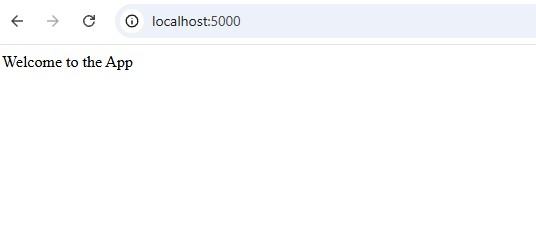

# Flask Voting App

This project is a simple Flask web application that lets users vote for candidates, view live results, and reset the poll. It is designed as an easy example of REST-style endpoints, in-memory data storage, and Git-based versioning in a real software project.

The app runs locally in a browser and shows how a small service can handle different URLs with different behaviors. It also demonstrates a clean Git workflow where development happens on the dev branch and stable releases are merged into the main branch.

## Installation and Setup

1. Clone the repository:
   ```bash
   git clone https://github.com/shivamrastogi7795-eng/flask-voting-app.git
   cd flask-voting-app
   ```

2. Create and activate a virtual environment:
   ```bash
   python -m venv .venv
   .venv\Scripts\activate
   ```

3. Install dependencies:
   ```bash
   python -m pip install -r requirements.txt
   ```

4. Run the application:
   ```bash
   python app.py
   ```
   The app will run on http://localhost:5000

5. Open the app in a browser:
   - http://localhost:5000/
   - http://localhost:5000/health
   - http://localhost:5000/vote/alice
   - http://localhost:5000/results
   - http://localhost:5000/reset

## API Endpoint Reference

| Endpoint | Method | Description | Example Response |
|---|---|---|---|
| / | GET | Welcome page for the app | Welcome to the App |
| /health | GET | Confirms the app is running | App is running |
| /vote/<name> | GET | Records one vote for the given candidate | Vote recorded for alice |
| /results | GET | Returns the current vote totals in JSON | {"alice": 2, "bob": 1} |
| /reset | GET | Clears all vote counts and resets the poll | Votes cleared successfully |

## Git Workflow

The project was developed using a professional Git branch workflow:

1. The feature work started on the dev branch.
2. Version 1 was committed as the basic Flask app.
3. The dev branch was merged into main only after the feature was complete.
4. Version 2 was developed again on dev, adding voting and reset functionality.
5. The second merge from dev into main created the stable production release.

This keeps the main branch stable while all new work happens in dev until it is ready to release.

```text
main ------------------------------> stable release
   \                               /
    \---- Version 1 merge -----------
     \                               /
      dev ----> feature work ----> merge to main
                              \       /
                               \-- Version 2 merge
```

## Version History

| Version | Status | What Was Added |
|---|---|---|
| Version 1 | Released | Basic Flask app with home and health endpoints |
| Version 2 | Released | Voting endpoint, results JSON output, and reset endpoint |

## Screenshots

### App running in the browser


### GitHub branches showing dev and main


### Commit and merge history showing Version 1 and Version 2


## Notes

This assignment demonstrates two things at the same time: building a small Flask web service and managing a real software release workflow with Git. The result is a clear, reusable example of endpoint design, API responses, and branch-based version control.
